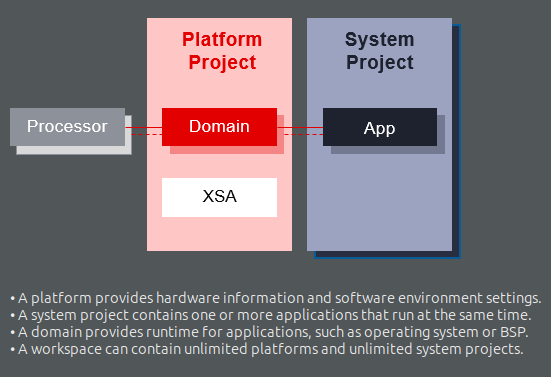

# hardwarwe accelerated app development using xilings tools
## Notes
- A Vitis accelerated application consists of two distinct components:    
  - a software program running on a standard processor such as an X86 processor, or ARM embedded processor
  - a Xilinx device binary (`xclbin`) containing hardware accelerated functions, or kernels.
- `AXI interface` is using for PS-PL communication 
- The software program uses the APIs from `XRT`(xilinx runtime) library to interact with the acceleration kernel thorugh AXI interface in the AMD device
```bash
Note: Installing XRT is not required when targeting Arm-based embedded platforms. The Vitis compiler has its own copy of xclbinutil for hardware generation, and for software compilation you can use the XRT from the sysroot on the Embedded Processor platform.
```
- vitis need a hardware desciption file (XSA - Xilinx Support Archive) for creating a platform specific applications
- if we are using PS only for develoment we need the XSA of our PS for creating our development platform
- in vitis 2021.1 XSA for kv260 PS is not available, so we need to downlaod it from external source
- To install a specific platform XSA, download the zip file and extract it into /opt/xilinx/platforms, or extract it into a separate location and add that location to the PLATFORM_REPO_PATHS environment variable.
- if we want to use both PS and PL we should have the specific pre build XSA from vivado 
- This XSA file contains:
  - FPGA bitstream
  - Memory map (AXI base addresses, IP registers)
  - Device tree information for Linux
- Vitis uses the .XSA file to generate Provides drivers and APIs to control FPGA IPs
- while hardware accelerated kernels are compiled into an executable device binary `.xclbin`

## platform in vitis
a platform provide hardware information and software environment settings.it mimic the target environment where the application code need to be run actually


kria prebuild platforms: https://github.com/Xilinx/kria-vitis-platforms


## Hardware Accelerated Applications
Hardware acceleration means offloading specific computations from the CPU to specialized hardware like GPUs, FPGAs, or ASICs for improved performance, power efficiency, and parallel processing.
### steps to create hardware accelareted applications for kv260 
* In Vivado, create an FPGA logic for hardware acceleration(in PL) and its communication setup with the ARM CPU(PS)
* Export the IP block developed in vivado and integrate it into a Vitis platform.
* In Vitis, develop an application to control the FPGA logic from the CPU.
* load the FPGA configuration bitstream to SOC
* Run the Linux application to communicate with the FPGA accelerator.

The API calls, managed by XRT, are used to process transactions between the host program and the hardware accelerators. Communication between the host and the kernel, including control and data transfers, occurs across the PCIe® bus or an AXI bus for embedded platforms. Control information is written to or read from specific address-mapped register in the kernels. Data buffers are exchanged between the host and kernels through global memory. Global memory is accessible by both the host processor and hardware accelerators, while host memory is only accessible by the host application.

## Vitis platform and application development can be divided into these parts:
- Platform hardware creation in Vivado. It exports an `XSA` file with clock, reset, AXI interface and interrupt signals and properties.
- Platform software preparation with common image or using PetaLinux tool, including Linux kernel, rootfs, device tree and boot components.
- Platform creation in Vitis to combine all hardware and software components and generate `XPFM` description.
- Create applications in Vitis against the platform. Vitis generates host application, xclbin and sd_card.img.
- Write sd_card.img to SD card or update host application and xclbin to an existing SD card.

## Understanding Vitis Build Targets
The Vitis compiler provides three different build targets: two emulation targets used for debug and validation purposes, and the default hardware target used to generate the actual FPGA binary:
- `Software Emulation`: The kernel code is compiled to run on the host processor. This allows iterative algorithm refinement through fast build-and-run loops. This target is useful for identifying syntax errors, performing source-level debugging of the kernel code running together with application, and verifying the behavior of the system.
- `Hardware Emulation`: The kernel code is compiled into a hardware model (RTL), which is run in a dedicated simulator. This build-and-run loop takes longer but provides a detailed, cycle-accurate view of kernel activity. This target is useful for testing the functionality of the logic that will go in the FPGA and getting initial performance estimates.
- `Hardware`: The kernel code is compiled into a hardware description language (RTL), and then synthesized and implemented for a target AMD device, resulting in a binary (xclbin) file that will run on the actual FPGA.

## vitis compilers
- The Vitis build process follows a standard compilation and linking process for both the host program and the kernel code 
  - `GNU C++ Arm cross-compiler` for building applications code
  - `Vitis compiler (v++)` for building FPGA binary (hardware kernal),
First the kernels are compiled into a xilinx object (`.xo`) file. Then, the .xo files are linked with the hardware platform to generate the xilinx device binary (`.xclbin`) file.

## how a software program interact with hardware kernal
here are multiple ways by which the software program can interact with the hardware kernels. The simplest method can be decomposed into the following steps:
- The host application writes the data needed by a kernel into the global memory of the FPGA device.
- The host program sets up the input parameters of the kernel.
- The host program triggers the execution of the kernel.
- The kernel performs the required computation, accessing global memory to read or write data, as necessary. Kernels can also use streaming connections to communicate with other kernels, passing data from one kernel to the next.
- The kernel notifies the host that it has completed its task.
- The host program transfers data from global memory back into host memory, or can give ownership of the data to another kernel.


# hardware accelerated application development for kv260 using vitis
https://xilinx.github.io/kria-apps-docs/creating_applications/2022.1/build/html/index.html

another guide:https://docs.amd.com/r/2022.1-English/ug1393-vitis-application-acceleration/Setting-Up-the-Environment-to-Run-the-Vitis-Software-Platform

hardware accelerated application can be doveloped using different methodes(called as development flow)
1. vitis platform flow
2. vitis accelerator flow
3. vivado accelerator flow
4. bare-metal flow
5. Custom Carrier Card Flow

The design artifact captured from any of the workflows(not sure about bare-metal flow)for designing a PL configuration is a bitstream (.bit, often required in .bit.bin form). This bitstream can be loaded at boot as part of the device boot firmware, or after the OS boot via a runtime library.


```bash
#note: development flows 4,5 don`t need vitis
``` 
## Vitis platform flow example
https://docs.amd.com/r/2022.2-English/Vitis-Tutorials-Vitis-Platform-Creation/Custom-Kria-SOM-Platform-Creation-Example
- in this example we are developing an hardware accelerated application for vector addition. ie, we are offloading burden of vector addition to a special hardware created on PL
- install OS and setup communication interface to kv260
- using vivado create a specific hardware (ps and pl-ps communcation interface(AXI)) for interfacing hardware kernal(PL) designed for vector addition.the output of step is XSA file
- generate dts file from XSA file using createdts command in XSCT
- create compiled version of dts, dtbo using DTC
- then create a `vitis platform`(on vitis) using the above `XSA`, which contain `dtbo` and `sysroot`
- then in vitis,import prewritten vector addition application and build it for running on kv260 
  - in this step we are building hardware kernal, PS-PL interfacer and application seperately.
  - we will get a `xclbin`(harware kernal) and executable app file 
- copy app,dtbo,xclbin and shell.json files to kv260
- load app using xmutil
- run app
### errors
- while trying to create a device tree blob overlay from XSA
  - error- createdts: command not found
    - solution: source vitis environment properly
      ```bash
      source <Vitis_tool_install_dir>/settings64.sh
      ```
  - in xsct - Error: please set a workspace or provide -out directory
    - solution: add the following to our command -out <output_directory>
- errors while running application on kv260
  - ```
    error while loading shared libraries: libxilinxopencl.so.2: cannot open shared object file: No such file or directory
    ```
    - solution: this is because of the absence of xrt library, install it 
      ```
      sudo dnf install xrt
      ```
  - ```
    EXE: /home/petalinux/vadd
    [XRT] ERROR: No devices found
    Error: Unable to find Target Device 
    ```
    - solution: this usually indicates that the XRT (Xilinx Runtime) cannot detect your FPGA device(https://github.com/Xilinx/Vitis-Tutorials/issues/262)
      - try installing XRT version compatable to our OS 
        - tried xrt versions 202210.2.13.479-r0.0 and 202210.2.14 on petalinux 22.1 OS,its not working
      - try changing OS to latest embedded linux(yocto),it has the latest packages `(working)`

## vitis accelerator flow 


## Bare metal build methods
This section describes how to create a sample Hello World application using an existing template.
- Launch the Vitis software platform.
- Select a workspace directory for your first project.
Click Launch. The welcome page appears.
- Close the welcome page.
- Select File > New > Application Project.
Type a project name into the Project Name field.
- Select the location for the project. You can use the default location as displayed in the Location field by leaving the Use default location check box selected. Otherwise, click the check box and type or browse - to the directory location.
- Select Create a new platform from hardware (XSA). The Vitis IDE lists all the available predefined hardware designs.
- Select any one hardware design from the list and click Next.
- From the CPU drop-down list, select the processor for which you want to build the application. This is an important step when there are multiple processors in your design. In this case you can either select psu_cortexa53_0 or psu_cortexr5_0.
- Select your preferred language: C or C++.
- Select an OS for the targeted application.
- Click Next to advance to the Templates screen.
- Select Hello World and click Next. Your workspace opens with the Explorer pane showing the hello_world_system system project and the KV260 platform project.
- Right-click the system project and select Build Project. You have now built your application and the Console tab shows the details of the file and application size.

Now that you have generated the executable binary, you can test it on a board. To run the application on the board, perform the following preliminary steps: 
- Connect a JTAG cable to the computer.
- Set the Boot Mode switch of the board to JTAG mode. 
- Connect a USB UART cable and setup your UART console. Power up the board. 
- Expand the system project and choose the application project you want to debug.
- Right-click the application and select Debug As → Launch on Hardware (Single Application Debug).
- On the Confirm Perspective Switch dialog, click Yes. The Vitis IDE switches to the Debug perspective and the debugger stops at the entry to your main() function. 
- Using the commands in the toolbar, step through the application. - After you step through the print() function, Hello World appears in the UART console