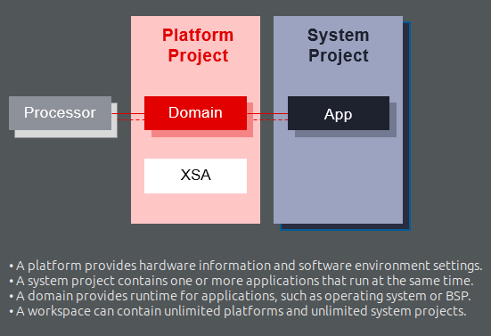

<table class="sphinxhide" width="100%">
 <tr>
   <td align="center"><h1>Vitis™ unified software platform</h1>
   <a href="https://www.xilinx.com/products/design-tools/vitis.html">See Vitis™ Development Environment on xilinx.com</a>  </td>
 </tr>
</table>
The Vitis™ unified software platform enables the development of embedded software and accelerated applications on heterogeneous Xilinx® platforms including FPGAs, SoCs, and Versal™ ACAPs.


## The platform includes the following tools & libraries
- `Vitis` (previously xilinx sdk) is an integrated development environment (IDE) based on eclips. 
- [`vitis HLS`](vitis%20HLS.md): High Level Synthesis – develop hardware acceleration on FPGA using C, C++, or OpenCL instead of Verilog/VHDL.
-  `Vitis Embedded` – For developing C/C++  application code running on embedded Arm processors
- [`Vitis AI`](vitis%20AI) – Optimized for AI/ML acceleration on Xilinx platforms.
- Integration with Xilinx Vivado – For FPGA logic design.
- `Vivado® Design Suite` for implementing the kernel on the target device, and for developing custom hardware platforms.
- `Vitis Model Composer`: A model-based design tool that enables rapid design exploration within the MathWorks Simulink® environment
- `Vitis Analyzer`
- `Compiler and simulators` – For implementing designs using the AI Engine array
- A set of open-source, performance-optimized library functions, such as DSP, Vision, Solver, Ultrasound, BLAS, and many more, that can be implemented in FPGA fabric or using AI Engines
- vitis allow flashing our program via serial port
    
## reference links
- vitis github: https://github.com/Xilinx/kria-vitis-platforms
- vitis tutorial: https://github.com/Xilinx/Vitis-Tutorials/tree/2024.2?tab=readme-ov-file#tutorials


## Notes
- A Vitis accelerated application consists of two distinct components:    
  - a software program running on a standard processor such as an X86 processor, or ARM embedded processor
  - a Xilinx device binary (`xclbin`) containing hardware accelerated functions, or kernels.
- `AXI interface` is using for PS-PL communication 
- The software program uses the APIs from `XRT`(xilinx runtime) library to interact with the acceleration kernel thorugh AXI interface in the AMD device
```bash
Note: Installing XRT is not required when targeting Arm-based embedded platforms. The Vitis compiler has its own copy of xclbinutil for hardware generation; and for software compilation you can use the XRT from the sysroot on the Embedded Processor platform.
```
- vitis need a hardware desciption file (XSA - Xilinx Support Archive) for creating a platform specific applications
- if we are using PS only for develoment we need the XSA of our PS for creating our development platform
- in vitis 2021.1 XSA for kv260 PS is not available, so we need to downlaod it from external source
- To install a specific platform XSA, download the zip file and extract it into /opt/xilinx/platforms, or extract it into a separate location and add that location to the PLATFORM_REPO_PATHS environment variable.
- if we want to use both PS and PL we should have the specific pre build XSA from vivado 
- This XSA file contains:
  - FPGA bitstream
  - Memory map (AXI base addresses, IP registers)
  - Device tree information for Linux
- Vitis uses the .XSA file to generate Provides drivers and APIs to control FPGA IPs
- while hardware accelerated kernels are compiled into an executable device binary `.xclbin`

## platform in vitis
a platform provide hardware information and software environment settings

## Installation 
- The best approach is to install `Vitis Core Development Kit` that combines all aspects of Xilinx® software development into one unified environment.
- it includes Vivado® Design Suite, Vitis Model Composer, Vitis HLS and software development tool stack, such as compilers and cross-compilers, to build your host program and kernel code, analyzers, debugger. There is no need to install Vivado separately.
- vitis installation guide (choose vitis version from the top side) : https://docs.amd.com/v/u/en-US/ug1393-vitis-application-acceleration
- check installation guide for OS compatability,
  - `only vitis version 24.2 support ubuntu 24.04`
  - `vitis version 22.2 and above support ubuntu 22.4`
- it is suggested to download required packages and manually install it,it allows to reuse the downloaded package incase of any installation errors   
- download vitis: https://www.xilinx.com/support/download/index.html/content/xilinx/en/downloadNav/vitis/2024-2.html  

### installation errors
- installation stuck at “Generating installed device list”.
  - This could be due to an unsupported OS
  - check the installation log to see an actual reason why the installation got stuck
  ```bash
  #installation log can be found at
  cd ~/.Xilinx/xinstall
  ```
  - Ubuntu 24.04 provides `libtinfo6`, but the vitis 22.1 installer needs `libtinfo5`. The solution is to install libtinfo5 before running the installer (libtinfo5 is not available in ubuntu 24 apt)
  ```bash
  sudo curl -O http://launchpadlibrarian.net/648013231/libtinfo5_6.4-2_amd64.deb

  sudo dpkg -i libtinfo5_6.4-2_amd64.deb
  ```
  - some other packages found to be good for installing if needed (use apt or other package managers to download)
    - libtinfo-dev
    - lib32stdc++6
    - libgtk2.0-0:i386
    - libfontconfig1:i386
    - libx11-6:i386
    - libxext6:i386 
    - libxrender1:i386
    - libsm6:i386

  - another solution found: https://adaptivesupport.amd.com/s/question/0D52E00006hpQNASA2/vivado-installation-got-stuck-says-generating-installed-devices-list?language=en_US
  - found the following warning while installing vitis 22.1,24.2 on ubuntu 24 using self extracting web installer
  ```bash
  Verifying archive integrity... All good.
  Uncompressing Xilinx Installer..................................................................................................................................................................................................................................................................................................................................................................................................................................................................................................................................................................................................................................................................................................................................................................................................................................................................................................................................................................................................................................................................
  This is a fresh install.

  INFO  - Started in: 2 Sec 

  INFO  - Internet connection validated, can connect to internet. 

  WARN  - MissingBundle for: DEFAULT_DESTINATION_FOLDER_LIN_DownloadSelectedProd, will use the key as the value 

  WARN  - MissingBundle for: DEFAULT_DESTINATION_FOLDER_LIN_DownloadSelectedProd, will use the key as the value 

  WARN  - MissingBundle for: DEFAULT_DESTINATION_FOLDER_LIN_DownloadSelectedProd, will use the key as the value 

  WARN  - MissingBundle for: DEFAULT_DESTINATION_FOLDER_LIN_DownloadSelectedProd, will use the key as the value 

  WARN  - MissingBundle for: DEFAULT_DESTINATION_FOLDER_LIN_DownloadSelectedProd, will use the key as the value 

  WARN  - MissingBundle for: DEFAULT_DESTINATION_FOLDER_LIN_DownloadSelectedProd, will use the key as the value 

  WARN  - MissingBundle for: DEFAULT_DESTINATION_FOLDER_LIN_DownloadSelectedProd, will use the key as the value 

  WARN  - MissingBundle for: DEFAULT_DESTINATION_FOLDER_LIN_DownloadSelectedProd, will use the key as the value 

  WARN  - MissingBundle for: DEFAULT_DESTINATION_FOLDER_LIN_DownloadSelectedProd, will use the key as the value 

  WARN  - MissingBundle for: DEFAULT_DESTINATION_FOLDER_LIN_DownloadSelectedProd, will use the key as the value 

  WARN  - MissingBundle for: DEFAULT_DESTINATION_FOLDER_LIN_DownloadSelectedProd, will use the key as the value 

  WARN  - MissingBundle for: DEFAULT_DESTINATION_FOLDER_LIN_DownloadSelectedProd, will use the key as the value 

  WARN  - MissingBundle for: DEFAULT_DESTINATION_FOLDER_LIN_DownloadSelectedProd, will use the key as the value 

  WARN  - MissingBundle for: DEFAULT_DESTINATION_FOLDER_LIN_DownloadSelectedProd, will use the key as the value 

  INFO  - Download image directory is /home/user/Downloads/xlnx_dwnld_pkg 

  ERROR - Checksum failed, expected: 889161cf7a169c41ef7b6032fdd6a1c3 but was: 7ba83f98fc1ef777f261638b6be5d1c1 for file https://amd-ax-dl.entitlenow.com/dl/ul/2022/04/20/R210580947/rdi_0890_2022.1_0420_0327.xz?hash=SvQmN60YnJ428R-O-WBGTw&expires=1739541734&filename=rdi_0890_2022.1_0420_0327.xz&sessionid=060dd96a-f69c-4925-b035-a84444325ca5 

## Hardware Accelerated Applications
Hardware acceleration means offloading specific computations from the CPU to specialized hardware like GPUs, FPGAs, or ASICs for improved performance, power efficiency, and parallel processing.
### steps to create hardware accelareted applications for kv260 
* In Vivado, create an FPGA logic for hardware acceleration(in PL) and its communication setup with the ARM CPU(PS)
* Export the IP block developed in vivado and integrate it into a Vitis platform.
* In Vitis, develop an application to control the FPGA logic from the CPU.
* load the FPGA configuration bitstream to SOC
* Run the Linux application to communicate with the FPGA accelerator.

The API calls, managed by XRT, are used to process transactions between the host program and the hardware accelerators. Communication between the host and the kernel, including control and data transfers, occurs across the PCIe® bus or an AXI bus for embedded platforms. Control information is written to or read from specific address-mapped register in the kernels. Data buffers are exchanged between the host and kernels through global memory. Global memory is accessible by both the host processor and hardware accelerators, while host memory is only accessible by the host application.

## Understanding Vitis Build Targets

The Vitis compiler provides three different build targets: two emulation targets used for debug and validation purposes, and the default hardware target used to generate the actual FPGA binary:

- `Software Emulation`: The kernel code is compiled to run on the host processor. This allows iterative algorithm refinement through fast build-and-run loops. This target is useful for identifying syntax errors, performing source-level debugging of the kernel code running together with application, and verifying the behavior of the system.

- `Hardware Emulation`: The kernel code is compiled into a hardware model (RTL), which is run in a dedicated simulator. This build-and-run loop takes longer but provides a detailed, cycle-accurate view of kernel activity. This target is useful for testing the functionality of the logic that will go in the FPGA and getting initial performance estimates.

- `Hardware`: The kernel code is compiled into a hardware description language (RTL), and then synthesized and implemented for a target AMD device, resulting in a binary (xclbin) file that will run on the actual FPGA.
## vitis compilers
- The Vitis build process follows a standard compilation and linking process for both the host program and the kernel code 
  - `GNU C++ Arm cross-compiler` for building applications code
  - `Vitis compiler (v++)` for building FPGA binary (hardware kernal),
First the kernels are compiled into a AMD object (`.xo`) file. Then, the .xo files are linked with the hardware platform to generate the AMD device binary (.xclbin) file.
## how a software program interact with hardware kernal
here are multiple ways by which the software program can interact with the hardware kernels. The simplest method can be decomposed into the following steps:

- The host application writes the data needed by a kernel into the global memory of the FPGA device.
- The host program sets up the input parameters of the kernel.
- The host program triggers the execution of the kernel.
- The kernel performs the required computation, accessing global memory to read or write data, as necessary. Kernels can also use streaming connections to communicate with other kernels, passing data from one kernel to the next.
- The kernel notifies the host that it has completed its task.
- The host program transfers data from global memory back into host memory, or can give ownership of the data to another kernel.

## Vitis embedded software development flow
The Vitis application acceleration development flow provides a framework for developing and delivering FPGA accelerated applications using standard programming languages for both software and hardware components. The software component, or host program, is developed using C/C++ to run on x86 or embedded processors, with OpenCL™ API calls to manage runtime interactions with the accelerator. The hardware component, or kernel, can be developed using C/C++, OpenCL C, or RTL. The Vitis software platform promotes concurrent development and test of the Hardware and Software elements of an heterogeneous application.

## Bare metal build methods
This section describes how to create a sample Hello World application using an existing template.
- Launch the Vitis software platform.
- Select a workspace directory for your first project.
Click Launch. The welcome page appears.
- Close the welcome page.
- Select File > New > Application Project.
Type a project name into the Project Name field.
- Select the location for the project. You can use the default location as displayed in the Location field by leaving the Use default location check box selected. Otherwise, click the check box and type or browse - to the directory location.
- Select Create a new platform from hardware (XSA). The Vitis IDE lists all the available predefined hardware designs.
- Select any one hardware design from the list and click Next.
- From the CPU drop-down list, select the processor for which you want to build the application. This is an important step when there are multiple processors in your design. In this case you can either select psu_cortexa53_0 or psu_cortexr5_0.
- Select your preferred language: C or C++.
- Select an OS for the targeted application.
- Click Next to advance to the Templates screen.
- Select Hello World and click Next. Your workspace opens with the Explorer pane showing the hello_world_system system project and the KV260 platform project.
- Right-click the system project and select Build Project. You have now built your application and the Console tab shows the details of the file and application size.

Now that you have generated the executable binary, you can test it on a board. To run the application on the board, perform the following preliminary steps: 
- Connect a JTAG cable to the computer.
- Set the Boot Mode switch of the board to JTAG mode. 
- Connect a USB UART cable and setup your UART console. Power up the board. 
- Expand the system project and choose the application project you want to debug.
- Right-click the application and select Debug As → Launch on Hardware (Single Application Debug).
- On the Confirm Perspective Switch dialog, click Yes. The Vitis IDE switches to the Debug perspective and the debugger stops at the entry to your main() function. 
- Using the commands in the toolbar, step through the application. - After you step through the print() function, Hello World appears in the UART console

## Vitis platform flow example
https://docs.amd.com/r/2022.2-English/Vitis-Tutorials-Vitis-Platform-Creation/Custom-Kria-SOM-Platform-Creation-Example
- in this example we are developing an hardware accelerated application for vector addition. ie, we are offloading burden of vector addition to a special hardware created on PL
- for this operration we need a OS installed on our kv260
- first we create a vector addition hardware on vivado,the output file XSA will use for creating dtbo file
-  then we will create a `vitis platform`(on vitis) using the above `XSA` which contain `dtbo` and `sysroot`
- after this we will create a application and build it for running on kv260 
  - in this step we are building hardware kernal, PS-PL interfacer and application seperately.
- copy the build to kv260
- load app
- run app
### errors
- while trying to create a device tree overlay in vitis for vitis platform
  - error- createdts: command not found
    - solution: source vitis environment properly
  - in xsct - Error: please set a workspace or provide -out directory
    - solution: add the following to our command -out <output_directory>
- errors while running application on kv260
  - ```
    error while loading shared libraries: libxilinxopencl.so.2: cannot open shared object file: No such file or directory
    ```
    - solution: sudo dnf install xrt
  - ```
    EXE: /home/petalinux/vadd
    [XRT] ERROR: No devices found
    Error: Unable to find Target Device 
    ```
    usually indicates that the XRT (Xilinx Runtime) cannot detect your FPGA device
      - solution: options
        - https://github.com/Xilinx/Vitis-Tutorials/issues/262 
        - tryed installing old version of XRT from dnf(202210.2.13.479-r0.0)- not working
        - try vitis platfrom creation step again
        - try changing os from petalinux to embedded linux(yocto)


## doubts
* are we creating general purpose applications or application for PS-PL communucation using vitis?
    - vitis can be Used for software development on the ARM Cortex-A53 cores (PS), including Linux applications, bare-metal firmware, and managing PS-PL communication.
* if we are using vitis for general purpose application development,why can't with other IDEs?
* Why Do We Feed the Vivado Bitstream to Vitis Before Development?
    - The reason for this is to ensure that the Processing System (PS) correctly recognizes and interacts with the Programmable Logic (PL).
    - Vitis uses the .xsa file to generate drivers and software APIs.
* what modifications are need to our OS if we add an hardware accelerator
